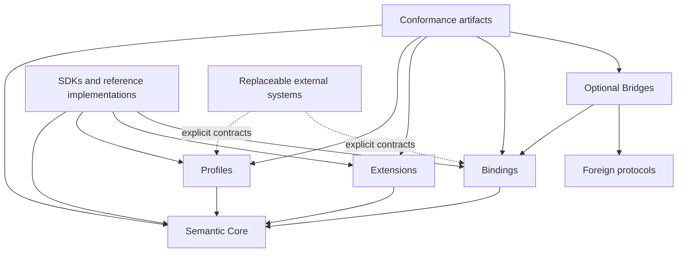
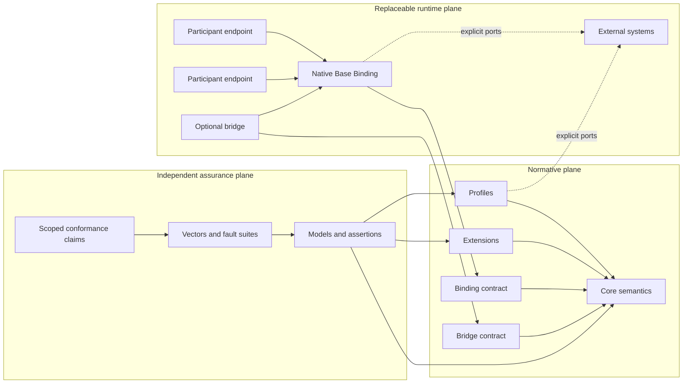

# Architecture Spine — AgentBridge AA-1

## Design Paradigm

**Semantic Hourglass Protocol Suite.** AgentBridge targets a small but complete role- and direction-neutral semantic waist for universal interaction and safety meaning. The precise minimum boundary remains a falsifiable architecture hypothesis until the scheduled universality, removal, cross-topology, strongest-composition and independent-implementation checks pass. The waist is designed as a set of implementation-independent, capability-secure, federated state machines. Ports and adapters isolate it from transports, providers, runtimes, and foreign protocols; those properties remain targets until AA-2--AA-7 evidence verifies them.

The waist is not a generic envelope. It owns every universal distinction required for independently implemented parties to agree on authority, action, effect, evidence, failure and evolution. Specialization and mechanism remain outside it.

## Invariants & Rules

### AD-1 — Semantic Hourglass and federated state-machine Core [ADOPTED]

- **Binds:** all protocol semantics, normative artifacts, Profiles, Extensions, Bindings, Bridges, SDKs, and conformance claims, together with each item's FR-1–FR-110/NFR-1–NFR-29/EI-01–EI-25/SBC-01–SBC-10 allocation, applicable QAS, threat boundary, accountable owner, and pass-evidence route.
- **Prevents:** a universal fat Core; an empty message envelope; coupling protocol meaning to one transport, language, vendor, runtime or foreign protocol; plugins overriding safety; reference code becoming the hidden standard.
- **Rule:** Core contains only candidate universal role- and direction-neutral safety and interoperability semantics that pass the Allocation, Universality and Removal tests. End-to-end authority and effect checks remain at the protected disclosure/effect boundary and cannot be replaced by delivery acknowledgement, intermediary assertion or infrastructure availability. Higher layers may narrow or strengthen Core, never weaken or reinterpret it. Core never depends upward, on a Bridge, or on a provider. A counterexample from strongest-composition, cross-topology, cross-domain or independent-implementation evidence reopens AD-1/AD-2 and forces reallocation.

### AD-2 — Strict responsibility and dependency allocation [ADOPTED]

- **Binds:** Core, Profiles, Extensions, Bindings, Bridges, External Systems, SDK/reference implementations and Conformance, including the owner/artifact/verification/closure-Gate assignments in `ALLOCATION-MATRIX.md` and the dependency threats in `ASSETS-ADVERSARIES-BOUNDARIES.md`.
- **Prevents:** domain or mechanism leakage into Core; hidden central/commercial dependencies; authority inflation; silent semantic loss; specification-by-implementation; cyclic artifact dependencies.
- **Rule:**
  - **Core** owns only universal, domain-neutral, independently testable interaction, authority, lifecycle/effect, evidence, evolution and safety semantics.
  - **Profiles** narrow and strengthen Core for a named scope; they cannot redefine Core or require a unique commercial provider.
  - **Extensions** add explicitly negotiated, namespaced, non-redefining behavior with declared dependencies, criticality and unknown handling.
  - **Bindings** preserve and realize selected semantics through replaceable transport, encoding, canonicalization and security mechanisms; transport success never proves external effect.
  - **Bridges** are optional, directed and version-pinned translations with explicit loss, provenance and assurance ceilings; critical unrepresentable meaning fails closed.
  - **External Systems** provide identity, discovery, policy, domain truth, effect execution, shared-limit authority or evidence storage through explicit replaceable contracts; their assertions are not unconditional protocol truth.
  - **SDK/reference implementations** are non-normative conveniences.
  - **Conformance** is an independent companion system. Specifications remain normative; assertions, models and vectors may reveal divergence but may not silently create requirements.

Core has no edge to any Profile, Extension, Binding, Bridge, SDK, provider or commercial service. Normative artifacts form an acyclic dependency graph, carry immutable kind, namespace, stable identifier, version, content digest, status and dependency closure, and are independently versioned. An operation pins the exact applicable closure for its lifetime. Released meaning is never edited in place.

### AD-3 — Horizontally complete, vertically bounded v0.x [ADOPTED, amended]

- **Binds:** every QAS in `QUALITY-ATTRIBUTE-SCENARIOS.md` to exact FR/NFR/EI/SBC IDs, accountable owner, pass evidence and closure Gate; Architecture Baseline v0.x scope; and the claims permitted at AA-6 and AA-7.
- **Prevents:** irreversible Core lock-in caused by a narrow happy path; an endless attempt to build the whole agentic internet at once; premature production, performance, adoption or standards claims.
- **Rule:**
  - v0.x covers the full abstract semantics needed by agent-service, agent-agent, service-service/B2B, reverse-asynchronous, delegated and multi-party interaction.
  - AA-6 designates one complete open provider-neutral mandatory Native Base Binding, two domain-neutral verification Profiles, an additive Extension model, an optional fail-closed Bridge contract and implementation-independent conformance architecture.
  - AA-7 tests and may falsify that claimed breadth against a frozen matrix using a second materially distinct experimental Native Binding, two unrelated non-production Domain Profiles, two independently defined Extensions and optional Bridges to at least two semantically distinct foreign protocol models.
  - Every result names the exact tested artifacts, environments and dependency versions. Validation artifacts do not become Core or mandatory runtime dependencies.
  - AA-1 fixes falsifiable scenarios and zero-tolerance safety outcomes; evidence-dependent numbers are frozen at their designated gate. AA-6 may claim only **Architecture Ready for Controlled Non-Production Implementation**. Actual scoped independent interoperability and performance are AA-7 claims.

## Assurance, evidence and execution boundary

`ALLOCATION-MATRIX.md` assigns every retained requirement/invariant/blocker to a primary responsibility, supporting layer, normative artifact, verification method and closure Gate. `QUALITY-ATTRIBUTE-SCENARIOS.md` binds observable stimuli and measures to exact FR/NFR/EI/SBC IDs, an accountable owner role and required pass evidence. `ASSETS-ADVERSARIES-BOUNDARIES.md` supplies the preliminary asset, adversary, trust/data/enforcement and owner boundaries. `ADR-DISCIPLINE.md` controls immutable decisions, supersession and re-open triggers. A Gate pass must cite exact artifact/dependency digests, QAS/assertion IDs, owner/reviewer/recusal records and reproducible evidence; a document title or reference implementation behavior is not evidence.

AA-2 may perform documentary specification, state-transition design and proof-obligation drafting. Any executable formal model, model-checker run, prototype, benchmark harness, fuzz/fault execution or other executable verification requires the concrete AD-21 Pre-Prototype Control Manifest to be frozen and approved first for that exact scope of artifacts, dependencies, data, egress, resources, and observers.

## Constitutional Safety Rules

1. Discovery, identity, authentication, delivery, receipt, signature and evidence are not by themselves authority or external truth.
2. Protected disclosure or consequential effect requires current, context-bound, monotonically narrowed authority at its enforcement boundary or a proved atomic equivalent.
3. Delivery, acceptance, authorization, execution, external effect and observed outcome remain distinct.
4. `unknown`, `partial`, conflict, timeout, cancellation and compensation never become implicit success or proof that no effect occurred.
5. Retry/replay preserves the same Operation Identity and Decision Subject or becomes a new operation; no global exactly-once claim is made.
6. Profiles, Extensions, Bindings and Bridges cannot expand authority, weaken a safety floor or reinterpret Core state.
7. Security-critical unknown, downgrade, loss or incompatible dependency closure fails closed for the dependent action.
8. Shared amounts and uses cannot be overspent, and quorum requirements cannot be bypassed; absent safe coordination or escrow, the result is non-permit/unknown.
9. Evidence remains an attributed, scoped claim with provenance and assurance limits; conflict and redaction remain visible.
10. Every public-facing path has bounded CPU, memory, state, I/O, payload, depth, fan-out, retry, amplification and wait behavior.
11. Native interoperability and self-conformance require no AgentBridge cloud, registry, broker, commercial SDK or Bridge.
12. No unresolved SBC, Critical/High finding, mandatory gate failure, rights/provenance defect or required independence/evidence/conformance gap can be accepted as residual risk.

## Consistency Conventions

| Concern | Convention |
| --- | --- |
| Normative language | Normative requirements use explicit MUST/MUST NOT/SHOULD semantics and stable assertion IDs; explanatory examples never create requirements. |
| Identity of meaning | Decision Subject, Operation Identity, artifact closure and security epoch are explicit and immutable within their stated lifetime. |
| State and failure | Allowed states and transitions come from the normative model; ambiguity yields typed incompatibility, non-permit, `unknown`, `partial` or conflict, never optimistic inference. |
| Authority | Authority is explicit, scoped and monotonically attenuated across delegation, branch, Profile, Binding and Bridge boundaries. |
| Evidence | Issuer, subject, observer, provenance, freshness, assurance and causal links are distinct; signatures prove only their stated claim. |
| Evolution | Released meaning is immutable. Change creates a new version and declared compatibility/migration outcome; identifiers are never reused with new meaning. |
| Dependency | Every dependency declares what it provides, requires, and terminates, along with its controller, version, trust, availability, compromise, substitution, and failure semantics. |
| Privacy | Every disclosed field and observable channel has a purpose, audience and bound; diagnostics and conformance do not bypass privacy. |
| Conformance | A claim names the exact Core/Profile/Extension/Binding/Bridge closure and verified scope. Reference behavior is never the oracle. |

## Structural Seed

This is a responsibility topology, not a deployment prescription. Concrete repository structure, language, runtime, transport, encoding and cryptographic suites remain unselected.

## Capability → Architecture Map

| Capability / Area | Lives in | Governed by |
| --- | --- | --- |
| CAP-1 Architecture Constitution | This spine and companion AA-1 package | AD-1--AD-3 |
| CAP-2 Abstract Normative Model | Core models and Profile refinements | AD-1, AD-2; AA-2 |
| CAP-3 Security, Privacy and Trust | Trust/enforcement boundaries and Profile/Binding obligations | AD-1, AD-2; AA-3 |
| CAP-4 Native Binding Architecture | Binding contract plus selected Base Binding | AD-2, AD-3; AA-4 |
| CAP-5 Conformance Architecture | Separate assurance plane | AD-2, AD-3; AA-5 |
| CAP-6 Integrated Baseline | Versioned closure of all normative and assurance artifacts | AD-1--AD-3; AA-6 |
| CAP-7 Independent Implementability | Spec-only/reference separation, exact genealogy and two independent implementations | AD-2, AD-3/AD-3A; AA-5--AA-7 |
| CAP-8 Controlled Publication and Evolution | Immutable artifact lifecycle, rights/governance gates and scoped publication/claim control | AD-2, AD-3, AD-15--AD-17; AA-8--AA-11 |
| FR/NFR/EI/SBC coverage | `ALLOCATION-MATRIX.md` | AD-1--AD-3 |

## Deferred

| Decision | Revisit condition |
| --- | --- |
| Exact participant, authority, operation, effect and evidence state machines | Documentary AA-2 work must satisfy `AA-2-NORMATIVE-MODEL-CONTRACT.md`; any executable formal model or model-checker run requires a frozen-approved concrete AD-21 Pre-Prototype Control Manifest first. |
| Exact trust, privacy, enforcement, compromise and recovery design | AA-3 threat architecture. |
| Base Binding transport, encoding, canonical form, security suites and numeric resource/performance budgets | AD-21 controls plus AA-4 prototypes and measurements. |
| Formal-methods tools | After documentary AA-2 obligations identify the smallest adequate combination; installation or execution requires the frozen-approved concrete AD-21 manifest. |
| Rust, Go or another reference implementation stack | AA-4 evidence and AA-6 implementation-scope decision. |
| Conformance oracle, vectors, observers and clean-room isolation | AA-5. |
| Objective eligibility of AA-7 diversity candidates | AD-22 / `AA-7-DIVERSITY-ELIGIBILITY.md` must freeze before candidate selection or exposure and blocks AA-7. |
| Reference repository structure and executable implementation | After AA-6; reference code is forbidden before then. |
| Concrete Bridges to MCP, A2A, UCP or other protocols | After Native semantics are stable and a version-pinned mapping has demonstrated value and bounded loss. |
| Production domain, jurisdiction and SLO | Separate AA-9 safety/compliance charter. |
| Market wedge, adoption and standard-status claims | Business Validation, AA-10 and AA-11 respectively. |
